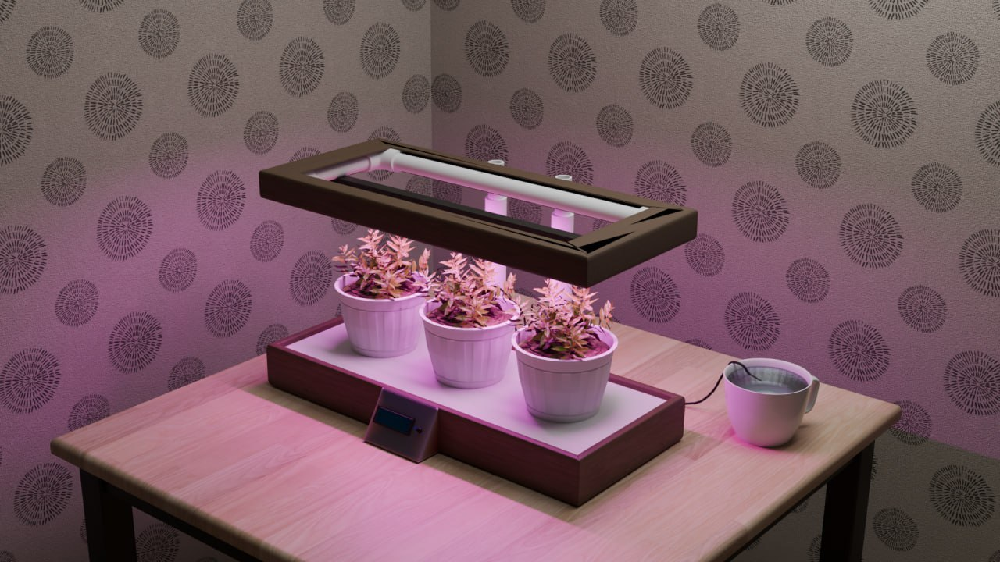
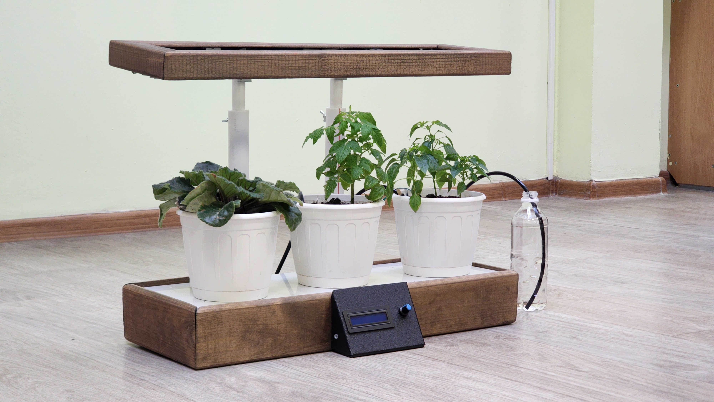
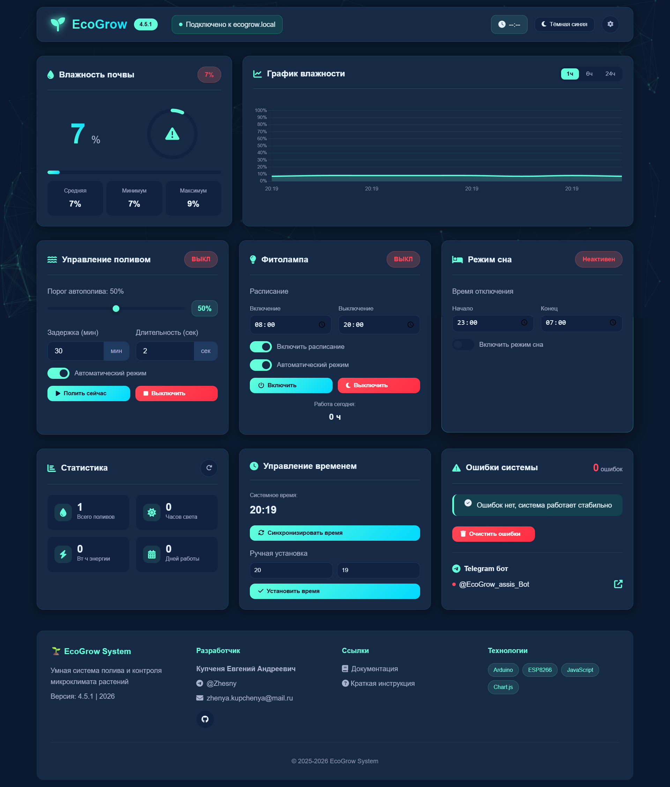

# 🌱 EcoGrow System - Умная система автоматического полива растений
**EcoGrow** — комплексная система автоматического полива и контроля микроклимата растений с современным веб-интерфейсом и мобильным приложением.

## 📸 Визуализация проекта

### 3D-модель системы

*3D-модель системы*

### Фото готового проекта

*Собранная и работающая система EcoGrow с подключенными датчиками*

## 🌐 Веб-интерфейс

### Скриншоты веб-панели

*Главная панель управления с графиками и контролами*

*Мобильная версия(представлен только экран главный экран с влажностью)*

## 🎯 Возможности

### 🤖 Интеллектуальная автоматизация
- **Автоматический полив** при снижении влажности ниже заданного порога
- **Расписание работы фитолампы** с точным контролем времени
- **Синхронизация времени** через NTP серверы

### 📱 Универсальное управление
- **Веб-интерфейс** с графиками в реальном времени
- **PWA приложение** для установки на смартфон
- **Telegram бот** для уведомлений 
- **Локальное управление** через LCD дисплей с энкодером

### 📊 Детальный мониторинг
- **Графики влажности** за 1, 6 и 24 часа
- **Статистика поливов** и работы света
- **Система оповещений** о критических состояниях
- **Несколько тем оформления** на выбор

### 🛡 Надежность и безопасность
- **Защита от сухого хода** насоса
- **Автовосстановление** Wi-Fi соединения
  
## 📱 Мобильное приложение (PWA)

**Преимущества PWA:**
- Установка без магазина приложений
- Push-уведомления
- Быстрый доступ с главного экрана
- Практически не занимает место на вашем устройстве

## 🤖 Telegram интеграция

Бот поддерживает команды:
- `/start` — приветствие и инструкция-
- `/help` - Справка по командам
- `/status` - Текущий статус системы
- `/moisture` - Влажность почвы
- `/stats` - Статистика работы
- `/errors` - Список ошибок системы
- `/web` - Ссылка на веб-панель управления

## 👨‍💻 Разработчик

**Купченя Евгений Андреевич**
- 🌐 GitHub: [zhesny](https://github.com/zhesny)
- 📧 Email: zhenya.kupchenya@mail.ru
- 📱 Telegram: [@Zhesny](https://t.me/Zhesny)

## 📊 Статус проекта

✅ **Рабочая версия:** v4.5.1  
✅ **Аппаратная часть:** Arduino UNO + ESP8266  
✅ **Веб-интерфейс:** PWA + адаптивный дизайн  
✅ **Telegram бот:** Полная интеграция  
✅ **Документация:** Полная на русском языке  
